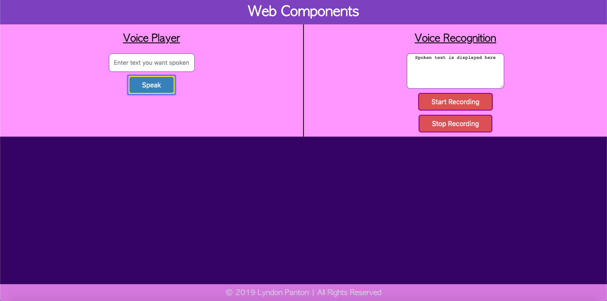
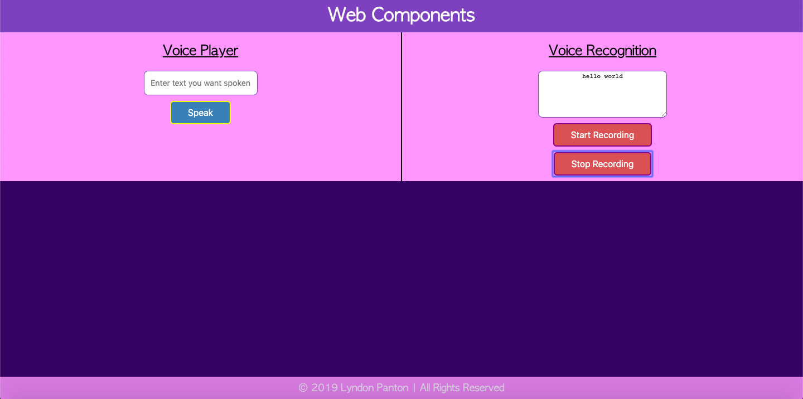

# Web Components

## How To Open
> 1. Go to the project's download folder
> 2. Start a local server on port 8000 in the folder
> 3. Open _localhost:8000_ in your desired browser

## How To Use
### Voice Player
> 1. Enter text you want spoken into the text input field
> 2. Press the _Speak_ button to hear the text spoken in a British accent

### Voice Recognition
> 1. Press the _Start Recording_ button
> 2. Speak the text you want displayed into the device
> 3. Press the _Stop Recording_ button
> 4. The words which inputted into the device's microphone will display in the textarea

## Requirements
> 1. This project requires a browser to run
> 2. The browser must have JavaScript available and enabled
> 3. The project must not be run with a _file://_ protocol

## Extra Information
> 1. This project was done for the w3c and Microsoft's *HTML5 Apps and Games* Program, the fifth of which I required for the *Front End Web Developer Professional Certificate*

## Preview

